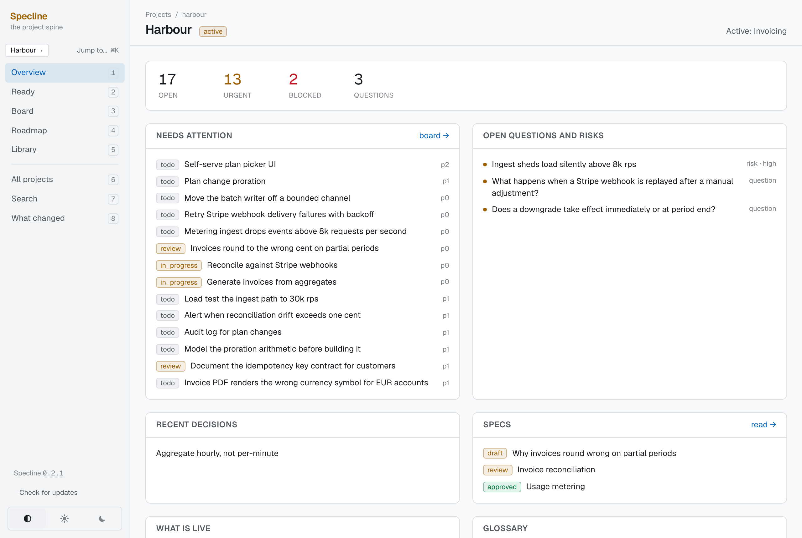
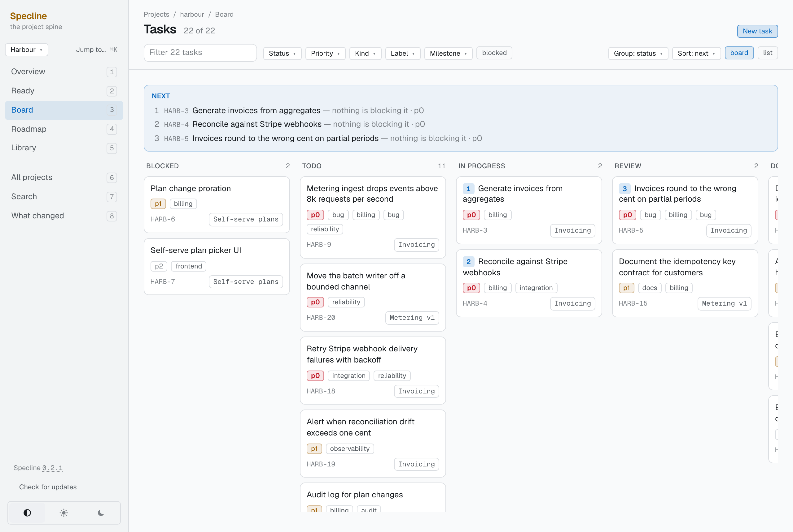
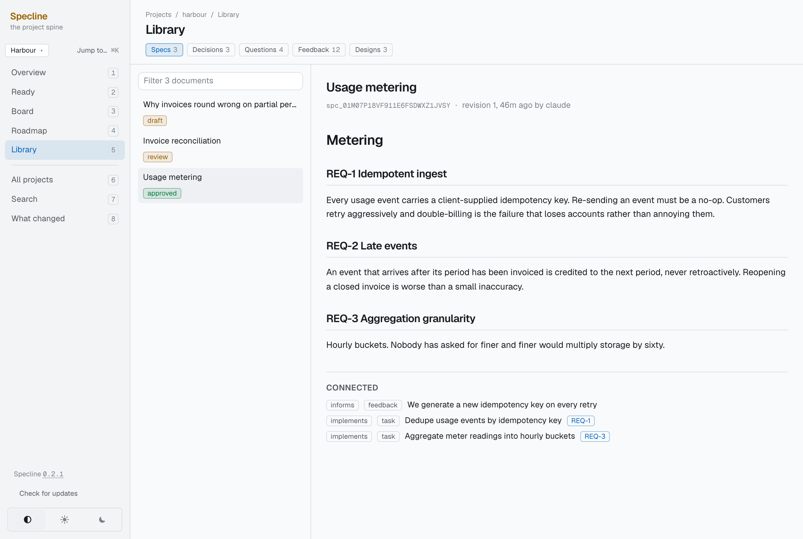
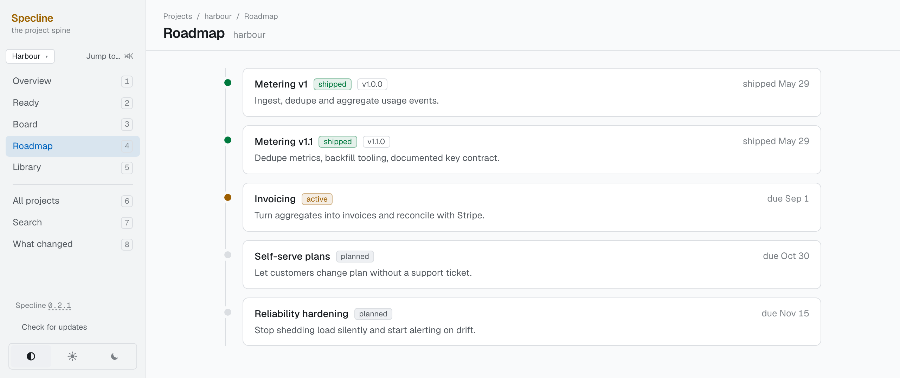

# Specline

Specline is a local store for everything about a software project **except the
code** — the specs, the decisions, the tasks, the open questions, the feedback,
the reasons. It runs on your machine, an AI coding agent reads and writes it
through [MCP](https://modelcontextprotocol.io), and an app shows you what is in
it.

---

## The problem

If you build software with an AI agent, you have probably noticed two things.

**Every session starts from nothing.** You explain the project again. What it
is, what you decided last week, why the obvious approach does not work, what is
half-finished. The agent is capable and has no memory, so the explaining never
ends and it is never quite the same explanation twice.

**What you decide in a conversation evaporates.** You spend forty minutes
working out that the queue has to be idempotent because retries are
at-least-once, you both agree, the code gets written — and the reasoning exists
nowhere. Six months later you find the code, cannot remember why, and either
rediscover the reasoning or quietly break it.

The usual answer is to write it down. In practice that means a wiki nobody
updates, a `NOTES.md` that goes stale in a fortnight, and an issue tracker built
for teams of thirty. All of them share one flaw: **keeping them current is a
separate chore from doing the work**, so it does not happen.

## What Specline does about it

The agent writes to Specline *while* you work, because it is right there in the
conversation. No separate step, no context switch, nothing to remember.

- You mention a constraint → it becomes a **decision**, with the reasoning attached.
- You say "we should probably…" → it becomes a **task**.
- Something turns out to be undecided → it becomes an **open question**, and every future session sees it before it re-litigates it.
- The agent works out *why* something is slow → that goes on the task as a **note**, attributed to the conversation that learned it.

The next session — different day, no memory — starts by reading the store and
knows where things stand.



**It stays yours.** Everything lives in `~/.specline` on your disk. No account,
no cloud, no telemetry. The daemon binds `127.0.0.1` and nothing else can reach
it.

**It writes readable files.** Specline generates markdown into your repository,
so the whole thing is greppable, diffable and committed alongside your code. If
Specline vanished tomorrow you would still have the files.

### What it is not

- Not a team tracker. One person, one machine, no permissions, no assignees.
- Not a replacement for GitHub Issues if you have a team using them.
- Not a note-taking app. You can file and close things yourself, but the reasoning gets written by the agent, in the conversation where it happened.
- Not a chat log. It stores what became *true*, not what was said.

---

## Install

You need [Claude Code](https://claude.com/claude-code). You do not need Rust,
and there are no files to edit.

Inside Claude Code:

```
/plugin marketplace add kiritbasu/specline
```

```
/plugin install specline@specline
```

```
/specline:setup
```

`/specline:setup` downloads the binaries, creates the store at `~/.specline`,
and starts the daemon. Then **restart Claude Code** — MCP servers connect at
startup, so the `specline_*` tools will not appear in the session that installed
them however well it went.

Installing the plugin is what registers the MCP server and the two session
hooks. There is no `claude mcp add` to run and no `settings.json` to edit.

The hooks are what make it work without you asking:

- **SessionStart** puts a short summary of the project at the top of every
  conversation, so the agent is oriented before you type anything.
- **Stop** fires when a session ends having recorded nothing, and asks it to. It
  stays silent for sessions that already wrote — a prompt that fires when you
  have done the right thing is a prompt you turn off.

Check it whenever you like:

```bash
specline doctor
```

### What leaves your machine

One request, and it is worth naming rather than leaving to be discovered: the
daemon fetches the latest release manifest once an hour so it can tell you a new
version exists. It sends nothing from your store — no project names, no counts,
no identifier — and nothing is installed without you agreeing to the restart.

`--no-update-check` on `/specline:setup` turns it off at install time and
`SPECLINE_AUTO_UPDATE=0` turns it off afterwards. With it off, Specline makes no
network requests at all.

---

## Using it

### Mostly, you do not

That is the point. Work with Claude the way you already do; Specline fills up as
a side effect.

Things that make the agent write, without being asked:

> "Let's go with the second option — Postgres, because we already run one."
> "That's a bug, the retry loop doesn't back off."
> "I don't know whether we need per-tenant keys. Leave it for now."

And things that make it read:

> "What's the state of the auth work?"
> "Why did we pick SQLite?"
> "What's blocking the release?"
> "What should I do next?"

### The interface

```bash
specline ui
```

The daemon serves it, compiled into the binary — no Node, no second process,
nothing to start. It opens whatever address the daemon is actually listening on,
so a non-default port needs no arguments.

A board, with what to pick up next ranked by what it unblocks rather than by
priority alone:



Documents that keep their reasoning, anchored so a task can point at one
requirement rather than a whole spec — and linked to the decision that motivated
them and the tasks that implement them:



A roadmap, a searchable everything, and an activity feed showing what changed
and which conversation changed it:



**The app writes what a person does, and does not author.** Creating a task,
commenting, closing, archiving — those are your own actions and the app performs
them. The *body* of a spec, a decision or a question is written by Claude in the
conversation where the thinking happened. The reasoning is the product, and a
person typing into a textarea produces a tracker with an AI feature attached,
which is the thing this is trying not to be.

### The command line

You rarely need it. The four worth knowing:

```bash
specline doctor
```

```bash
specline ready <project>
```

```bash
specline generate <project>
```

```bash
specline backup
```

`doctor` is the front door for "has anything quietly gone wrong" — it composes
every read-only check there is, including `fsck`, into one page. `ready` says
what to work on next. `generate` writes the markdown into your repo. `backup`
takes a consistent snapshot, and `restore` puts it back.

Everything works whether the daemon is running or not: the CLI asks the daemon
when one is there and opens the store directly when it is not.

**All 24 commands are documented in [docs/CLI.md](docs/CLI.md).**

---

## What is in it

Thirteen kinds of thing, and no more — the ceiling is deliberate, because "we
need a new type for this" is nearly always a field or a label in disguise:

**project**, **milestone**, **task**, **spec**, **decision**, **question**,
**term**, **feedback**, **design**, **environment**, **metric**,
**metric observation**, **artifact**.

They are connected by a typed graph — a task `implements` a spec, a decision
`supersedes` an earlier one, a task `blocks` another — and the graph is what
makes "what is actually blocked" a query rather than a guess.

The agent sees thirteen tools: `specline_context`, `specline_search`,
`specline_get`, `specline_projects`, `specline_activity`, `specline_create`,
`specline_update`, `specline_write_doc`, `specline_note`, `specline_link`,
`specline_ready`, `specline_claim`, `specline_close`. Thirteen rather than forty
because a model picks the right tool from a short list and the wrong one from a
long list.

---

## Generated files

Point a project at your repository and Specline writes markdown into it. A new
project gets:

```
.specline/README.md       what this project is, generated from the store
.specline/questions.md    open questions and settled ones, with the answers
.specline/glossary.md     the project's own vocabulary
.specline/manifest.json   what was written, and from which artifacts
```

As documents accumulate, `.specline/specs/` and `.specline/decisions/` fill up
with one file each.

Anything beyond that is opt-in. A document can **adopt a path of its own** —
tell Specline that a spec lives at `docs/SPEC.md` and that is where it will be
written from then on — and a project can name where its tracker and decision log
should go. That is how this repository ends up with `product/SPEC.md`,
`product/STATUS.md` and `product/DECISIONS.md`. None of those appear because you
created a project; they appear because someone asked for them.

**These are outputs.** Every one carries a banner saying so. Editing them is not
so much wrong as futile — the next `specline generate` overwrites them from the
store, and your words are gone.

To change what they say, change the source: ask Claude to rewrite it, or edit it
in the app. If you have already edited a file by hand and want the words kept,
`specline import <file>` writes it back in as a proper revision.

There is a pre-commit hook that refuses a commit carrying a hand-edited
generated file, so you find out immediately rather than when the next
regeneration eats it:

```bash
ln -sf ../../scripts/pre-commit .git/hooks/pre-commit
```

---

## Getting the most out of it

**Talk about the project, do not dictate records.** "We're going with Postgres
because we already run one" gets you a decision with reasoning. "Create a
decision record titled Postgres" gets you a row that says nothing in six months.

**Say the reason out loud.** The reasoning is the part with value later. The
choice itself is usually obvious in hindsight; the rejected alternative almost
never is.

**Use the readable IDs.** Tasks are `KEEL-42`, decisions are `B-12`. Say those
in conversation — they are stable forever and resolve everywhere an ID is taken.

**Let questions be questions.** If something is genuinely undecided, recording
it as an open question is worth more than a confident guess. Every session sees
open questions before it starts, which is what stops an agent quietly
re-deciding something you already settled.

**Do not hand-edit generated files.** Change the source.

**Run `specline doctor` occasionally**, and `specline backup` before anything
drastic.

**Restart the daemon after upgrading.** Specline refuses to start if the binary
is older than the store's schema, which turns a silent corruption into an error
you can read — but you still have to restart it.

---

## How it is built

Rust, one workspace, six crates, one SQLite file, and a daemon that owns the
only write path. Search is hybrid — FTS5 keyword and `sqlite-vec` similarity,
fused by reciprocal rank. Every change is an event carrying an author and the
conversation that made it.

**[docs/ARCHITECTURE.md](docs/ARCHITECTURE.md)** has the detail: the crate
layout, the storage model, why graph direction is the dangerous part, what the
app may and may not write, and the one feature flag that decides whether a
platform can be built at all.

### Building from source

You need [Rust](https://rustup.rs). This is the contributor's path — for using
Specline, the plugin install above is the one to follow.

```bash
git clone https://github.com/kiritbasu/specline.git && cd specline
```

```bash
./plugin/install.sh
```

That builds the binaries, puts them in `~/.cargo/bin` — the same place a release
installs, so there is only ever one copy — creates the store, and copies the
skill and hooks into `~/.claude/`.

After editing anything under `plugin/`, re-run `./plugin/install.sh
--skill-only`. It skips the build and copies the three files. **The copies under
`~/.claude` are what actually run**, so a change to the repository that is not
copied across does nothing at all.

```bash
cargo test --workspace
```

```bash
cargo clippy --workspace --all-targets -- -D warnings
```

```bash
cargo fmt --all --check
```

The screenshots above are taken from `specline fixture`, which loads an invented
corpus into an empty store — so they can be retaken identically whenever the
interface changes.

### Where the documentation is

All of it is in `product/`, and all of it is generated from the store:

- `product/PRD.md` — what this is for
- `product/SPEC.md` — how it works
- `product/DECISIONS.md` — every decision and why
- `product/STATUS.md` — what is open and what is next
- `product/CHANGELOG.md` — what has closed, with the reason and the evidence
- `product/JOURNAL.md` — what happened, session by session
- `product/GATE.md` — the one measurement that mattered, and why it stopped
